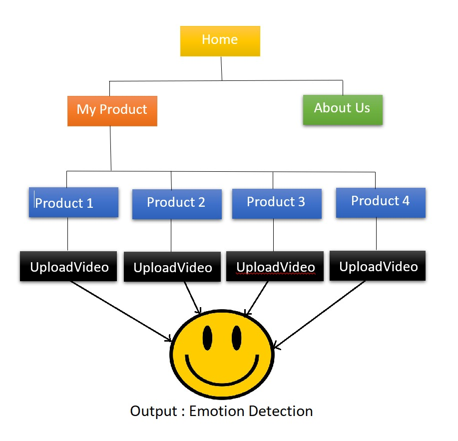
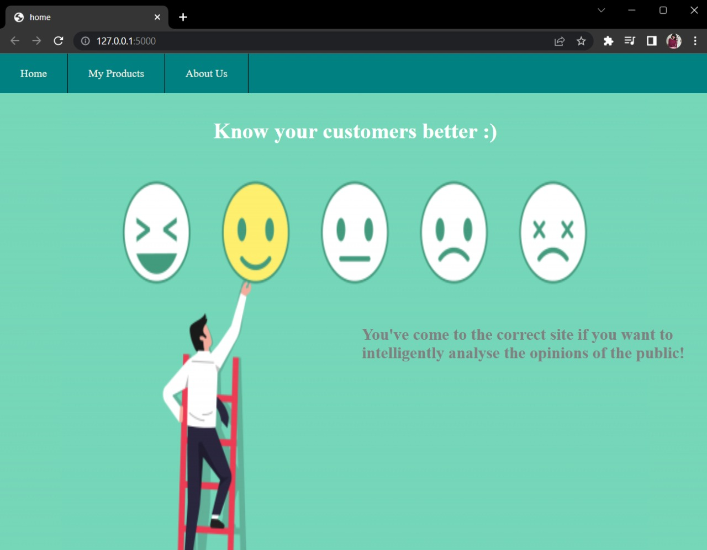
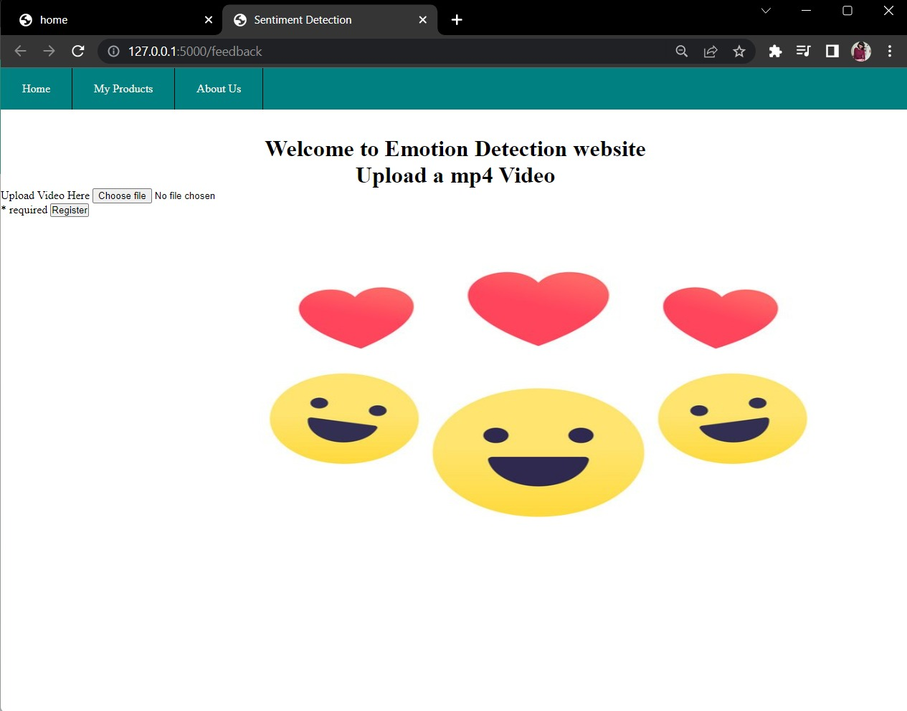
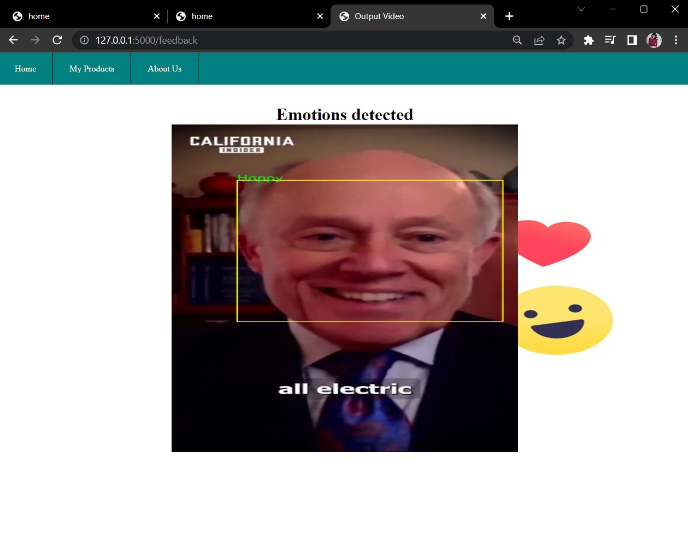
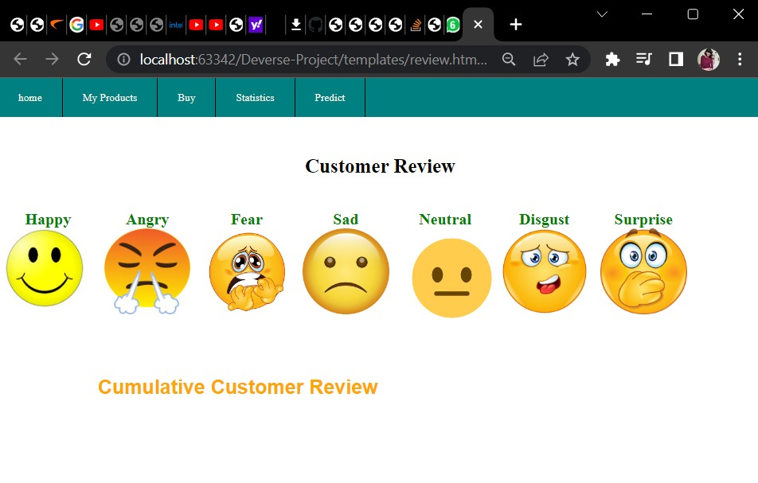

## Deverse-Emotion-Detection-Project
- Welcome to myfeeedback108 web application!
- We have created Deep Learning based human emotion detection model for Deverse'22. This model is fully functional and useable in real life. This is easy to use.

## Features
- Recognises customer face in uploaded review videos
- Predicts emotions of consumers in running video frames

## Website Features Design and Flow

## Website Layout
Homepage constitutes the basic features of application mentioned in the navigation bar.

## Home >> My Product
- Consists lists of client products uploaded for analysis
- Click on image of product to choose product

## Home >> MyProduct >> Base
- Upload video of consumer reactions 
- Press register Button!
- Video is successfully uploaded for analysis

## Home >> MyProduct >> Base >> VideoUpload
- Displays detected emotions with sufficient accuracy

## Tech Stack
MyFeedback108 web application successfully predicts emotions using a number of open source python libraries and tools:
- keras - 2.10.0
- matplotlib - 3.4.3
- opencv-python - 4.6.0.66
- numpy - 1.21.1
- seaborn - 0.11.2
- tensorflow - 0.11.2

## Future Enhancement 

## Installation
# Requirements
- Python 3.x

# Run the project
- Clone git repo in git bash
- In terminal run 'pip install requirements.txt'
- Run python app.py

## Video link of project with full explanation
